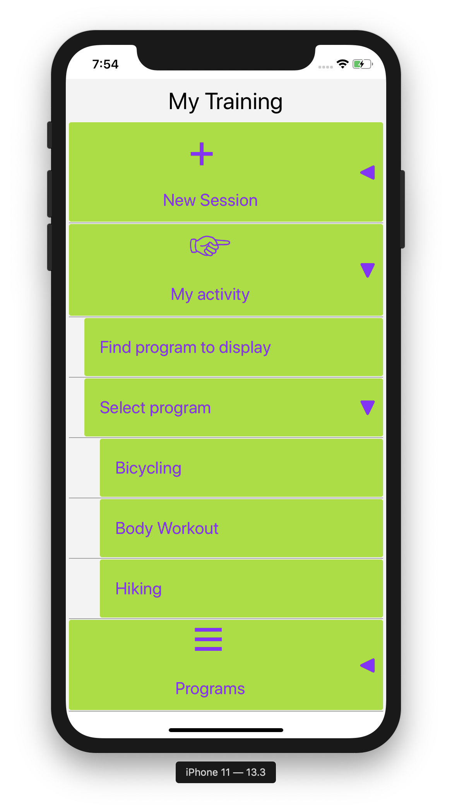

# react-native-tree-menu-simple
### A simple and flexible screen menu for react-native apps.

The menu structure is defined as a Javascript-object in code or in a separate .json file. The menu is styled with a settings object. By default unicode symbols are used as icons for the menu items and for the open/close icons. Alternatively menu items may be customised using whatever icon or image required. 

No dependencies required.

## TOC
- [Installation](#installation)
- [Use](#use)
- [Custom menu items](#custom-menu-items)
- [Settings](#settings)


## Installation
npm install react-native-tree-menu-simple --save
## Use
Example use:
```javascript

import {TreeMenu} from 'react-native-tree-menu-simple';

class App extends Component {
    constructor(props, context) {
        super(props, context);
    }
    
    onMenuItemClick(menuItem) {
        switch (menuItem.id) {
        case 'id_new_session':
            console.log('CLICK:' + menuItem.name);
            break;
            
        case 'id_activity':
            console.log('CLICK:' + menuItem.name);
            break;
        
        case 'id_programs':
            console.log('CLICK:' + menuItem.name);
            break;
        }
    }
    
    render() {
        // Menu structure:
        const menuData = require('./exercisemenu.json');
        
        // Generic menu item settings:
        let menuItemSettings = {
            closeOthersOnOpen: true,
            defaultIcon: '\u25AA',
            itemOpenCloseIcon: 'right',
            itemTextStyle: {
                fontSize: 22,
                color: '#000000',
                textAlign: 'left',
                marginLeft: 0,
            },
            itemStyle: {
                backgroundColor: '#E0E0FF',
                marginBottom: 0,
                marginTop: 0,
                marginLeft: 4,
                marginRight: 4,
                borderRadius: 3,
            },
            itemShowIcon: true,
            itemIconSize: 46,
            itemIconColor: '#AAA',
            itemOpenCloseIconColor: '#000',
            iconStyle: {},
            itemSeparator: true,
            itemSeparatorColor: '#A0A0A0',
            itemSeparatorMarginTop: 1,
            itemSeparatorMarginBottom: 1,
            itemSeparatorMarginLeft: 4,
            itemSeparatorMarginRight: 4,
            itemIndentValue: 20,
        };
        
        return (
        <TreeMenu
            menuData={menuData}
            menuItemSettings={menuItemSettings}
            itemClickHandler={item => this.onMenuItemClick(item)}
        />
        );
    }
}
```
### The exercisemenu.json file looks like this:
```json5
{
  "openMenuItemIcon": "\u25C0",
  "closeMenuItemIcon": "\u25BC",
  "menu":
  [
    {
      "id": "id_new_session",
      "icon": "\u2795",
      "name": "New Session",
      "subItems": [
        {
          "id": "id_new_session_find_program",
          "icon": "\u25AA",
          "name": "Find program",
          "subItems": []
        },
        {
          "id": "id_new_session_select_program",
          "icon": "\u25AA",
          "name": "Select program",
          "subItems": [
            {
              "id": "id_new_session_select_program1",
              "icon": "\u25AA",
              "name": "Bicycling",
              "subItems": []
            },
            {
              "id": "id_new_session_select_program2",
              "icon": "\u25AA",
              "name": "Body workout",
              "subItems": []
            },
            {
              "id": "id_new_session_select_program3",
              "icon": "\u25AA",
              "name": "Hiking",
              "subItems": []
            }
          ]
        }
      ]
    },
    {
      "id": "id_activity",
      "icon": "\u26F9",
      "name": "My activity",
      "subItems": [
        {
          "id": "id_activity_find_program",
          "icon": "\u25AA",
          "name": "Find program to display",
          "subItems": []
        },
        {
          "id": "id_activity_select_program",
          "icon": "\u25AA",
          "name": "Select program",
          "subItems": [
            {
              "id": "id_activity_select_program1",
              "icon": "\u25AA",
              "name": "Bicycling",
              "subItems": []
            },
            {
              "id": "id_activity_select_program2",
              "icon": "\u25AA",
              "name": "Body Workout",
              "subItems": []
            },
            {
              "id": "id_activity_select_program3",
              "icon": "\u25AA",
              "name": "Hiking",
              "subItems": []
            }
          ]
        }
      ]
    },
    {
      "id": "id_programs",
      "icon": "\u2630",
      "name": "Programs",
      "subItems": [
        {
          "id": "id_programs_select_program1",
          "icon": "\u25AA",
          "name": "Bicycling",
          "subItems": []
        },
        {
          "id": "id_programs_select_program2",
          "icon": "\u25AA",
          "name": "Body workout",
          "subItems": []
        },
        {
          "id": "id_programs_select_program3",
          "icon": "\u25AA",
          "name": "Hiking",
          "subItems": []
        },
        {
          "id": "id_programs_add",
          "icon": "\u25AA",
          "name": "Add new program",
          "subItems": []
        }
      ]
    },
    {
      "id": "id_exercises",
      "icon": "\u26BD",
      "name": "Exercises",
      "subItems": [
        {
          "id": "id_exercises_add",
          "icon": "\u25AA",
          "name": "Add new exercise",
          "subItems": []
        }
      ]
    }
  ]
}

```
The result i shown above.

## Custom menu items
You can customize each item using useCustomItemContentRenderer and renderCustomMenuItem.

```javascript
<TreeMenu
    menuData={menuData}
    menuItemSettings={menuItemSettings}
    itemClickHandler={menuItemObject => this.onMenuItemClick(menuItemObject)}
    useCustomItemContentRenderer={true}
    renderCustomMenuItem={menuItemObject =>
      this.renderCustomMenuItem(menuItemObject)
    }
/>
```

The renderCustomMenuItem() function will be called for each item for custom rendering.
```javascript
  renderCustomMenuItem(menuItemObject) {
    switch (menuItemObject.id) {
      case 'id_new_session':
        return (<View>. . . </View>);
      case 'id_activity':
        return (<View>. . . </View>);
      case 'id_programs':
        return (<View>. . . </View>);
      case 'id_exercises':
        return (<View>. . . </View>);
      default:
      	return (<View>. . . </View>);
    }
  }
```


## Settings
### TreeView properties

Property | Value | Description | Example
-------- | ------ | ------- | -------------
menuData | a menu data object  | A Javascript object | {menuData}
menuItemSettings | a menu settings object |  A Javascript object | {menuItemSettings}
itemClickHandler | a function  | A callback event function | {item => this.onMenuItemClick(item)}
useCustomItemContentRenderer | true or false | Use customized menu items or not. Works in conjuction with renderCustomMenuItem below | 
renderCustomMenuItem | a function |  | renderCustomMenuItem={menuItemObject => this.renderCustomMenuItem(menuItemObject) }

### Menu data
This is a Javscript object, specified in code or in a separate .json file (as shown above). Notice the unicode symbols used as both menu item icons and open/close menu item icons.
Overview of useful unicode symbols could be found here [Wikibooks](https://en.wikibooks.org/wiki/Unicode/List_of_useful_symbols#Health_and_safety) 

#### Required structure (as json):
```javascript
{
  "openMenuItemIcon": "\u25C0",
  "closeMenuItemIcon": "\u25BC",
  "menu":
  [
    {
      "id": "id_new_session",
      "icon": "\u2795",
      "name": "New Session",
      "subItems": [
        {
          "id": "id_new_session_find_program",
          "icon": "\u25AA",
          "name": "Find program",
          "showDropDownButton": true,
          "subItems": [
          	... etc. 
          ]
        },
        ... etc.
      ]
    },
    {
      ...
    }
  ]
}  
```

### Menu settings

Property | Description 
-------- | -------------
closeOthersOnOpen | If true, other menu items at the same level are closed when the current is opened. Default is true.
defaultIcon | Unicode value. This is used when there is no "icon" specified for the menu items in menuData (json). 
itemOpenCloseIcon | Where to place the open/close icon. Allowed values: 'left' or 'right'. Default is 'right'.
itemTextStyle | Standard react/jsx style object.
itemStyle | Standard react/jsx style object.
itemShowIcon | Show left menu icon or not. Default is true.
itemIconSize | Icon size. Default is 22.
itemIconColor | Icon color. Default is '#AAA'.
itemOpenCloseIconColor | Color on the open/close icons. Default is '#000'.
iconStyle | Standard react/jsx style object.
itemSeparator | Show separator line between menu items. Default is true.
itemSeparatorColor | Color on the separator line between menu items. Default is '#A0A0A0'.
itemSeparatorMarginTop | Separator line top margin. Default is 1.
itemSeparatorMarginBottom | Separator line bottom margin. Default is 1.
itemSeparatorMarginLeft | Separator line left margin. Default is 4.
itemSeparatorMarginRight | Separator line right margin. Default is 4.
itemIndentValue | Indent value. Indicates indent value for each submenu level. Default is 20.

##Example with customRenderer and vector-icons

The menu used in combination with https://github.com/oblador/react-native-vector-icons
Each menu item use different vector icons.

